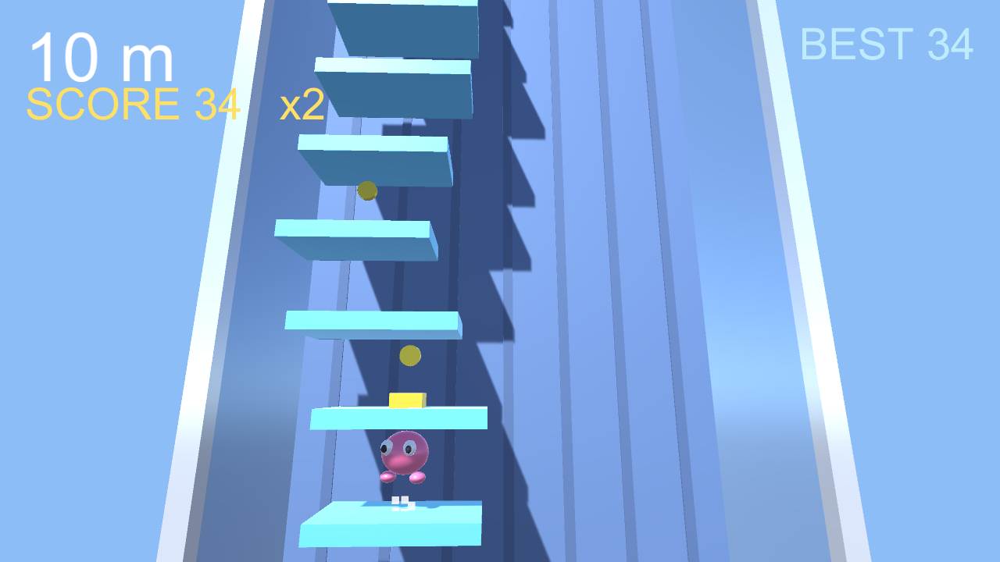

# 🦘 SKY HOPPER

> 跳ねるゼリーのヒーローを操り、果てしない空の塔を登り続ける、ワンタッチ3Dタワークライマー。

ワンタッチ操作で跳ねるゼリーのヒーローを操作し、終わりのない空の塔を登っていく 3D アクションゲームです。横方向の勢いをためてより高くジャンプし、壁バウンスでコンボを繋ぎ、コインやスプリングを集めながら、迫り上がってくる床から逃げ続けます。Unity 製の WebGL ビルドで、ブラウザから直接プレイできます。


🔗 **[Live Demo](https://masafykun.github.io/sky-hopper/)**

---

## 📸 スクリーンショット


---

## 🎮 操作方法
| 操作 | 動作 |
|---|---|
| タップ / クリック | ヒーローを操作してジャンプ・方向転換 |
| 横方向の勢いをためる | より高くジャンプ |
| 壁にぶつける | 壁バウンスでコンボを継続 |

---

## ✨ 特徴
- **ワンタッチ操作** — シンプルな操作で跳ねるヒーローを上へ導く
- **モメンタム ジャンプ** — 横方向の勢いをためて高く跳ぶ
- **壁バウンス & コンボ** — 壁に弾ませてコンボを繋ぐ
- **コイン & スプリング** — アイテムを集めつつ、迫り上がる床から逃げ続ける

---

## 🛠️ 技術スタック
| カテゴリ | 技術 |
|---|---|
| ゲームエンジン | Unity 6000.0.77f1 |
| 言語 | C#（`src/` 配下） |
| ビルド | WebGL |
| 配信 | GitHub Pages |

---

## 🚀 セットアップ

```bash
# WebGL ビルドはブラウザで直接プレイ可能
# Live Demo: https://masafykun.github.io/sky-hopper/

# ローカルで動かす場合（CORS 回避のため簡易サーバー経由で開く）
python3 -m http.server 8000
# ブラウザで http://localhost:8000/ を開く
```

C# ソースは `src/` ディレクトリにあります。Unity（6000.0.77f1）でプロジェクトとして開けます。

---

## ライセンス

[](https://opensource.org/licenses/MIT)

このプロジェクトは **MIT ライセンス** のもとで公開しています。

© 2026 masafykun (https://github.com/masafykun)
